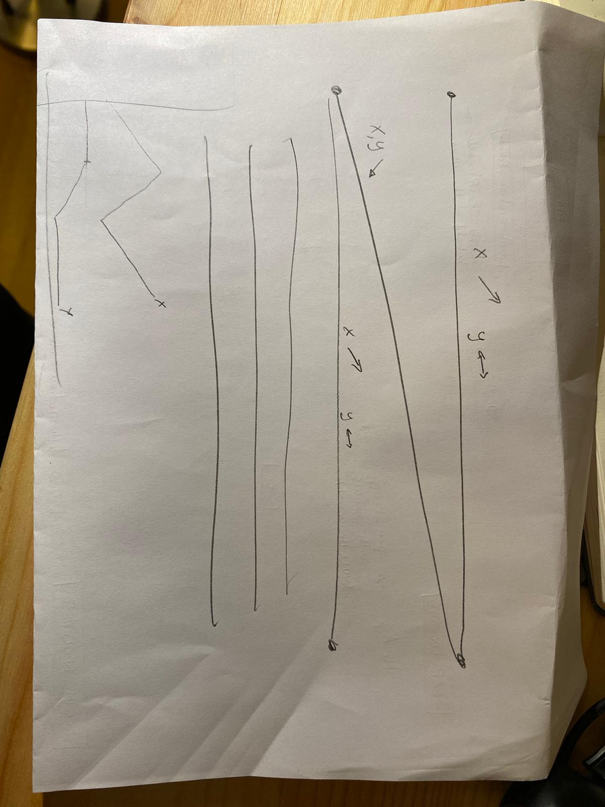
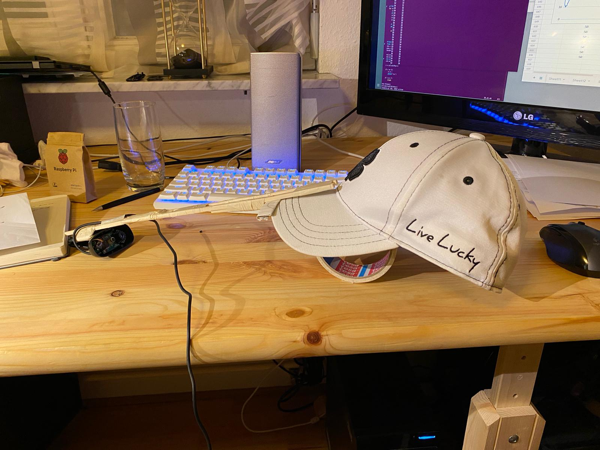
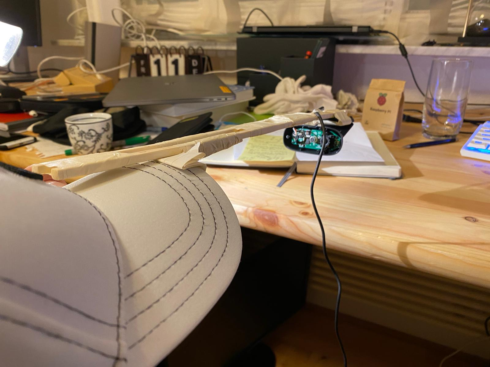
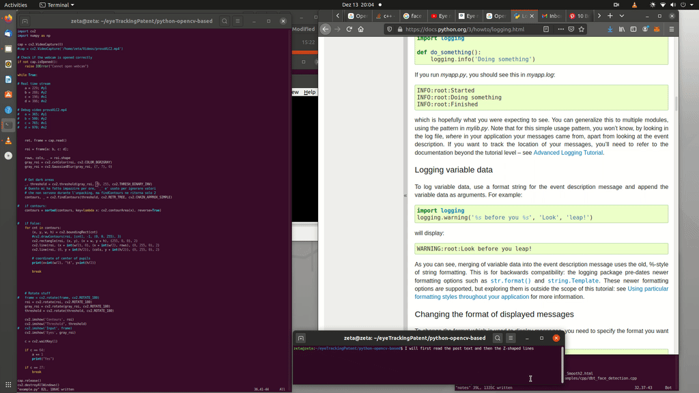

# Eye Tracker - return pupil coordinates

Install `python-opencv` and clearly `python`. Run with `python3 ./pupilCoordinates.py`
A USB webcam should be installed.

## Background

I wanted to analyze pupil movements to validate an idea, and I remembered that OpenCV was
there exactly for this kind of stuff.

The goal of this project is to measure precisely enough the movement of the pupil
while looking at a Z-shape figure and validate the signal would be good enough for small print
reading scenarios.

This is the Z-shaped figure used for testing

This is the webcam setup, camera should be fixed relative to the eyes, once 'mounted' you
can adjust the camera to have the eye centered in the control rectangle.

and this is a video of the conclusion of the 2 days research:

You can see the pupil x,y coordinates being collected by the tool and 
validated in Google Sheet graph, so show the expected position of the pupil
while reading and the comparison with the previous approach, where noise data was retrieved.

## Sources

I first tried with the good EyeLike (1), which is C++ based, still OpenCV.

But I had issues getting clean coordinates for the pupil position, I believe because the coordinates
where relative to the rectangle contouring the recognized faces.

I believe this problem could be solved by removing the known delta, but
while researching I came across (5), so I started over.

(1) https://github.com/trishume/eyeLike
(2) https://www.youtube.com/watch?v=kbdbZFT9NQI
(3) https://pysource.com/2019/01/04/eye-motion-tracking-opencv-with-python/

